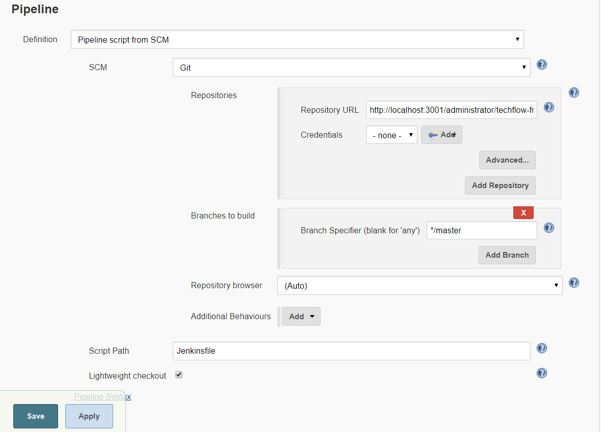
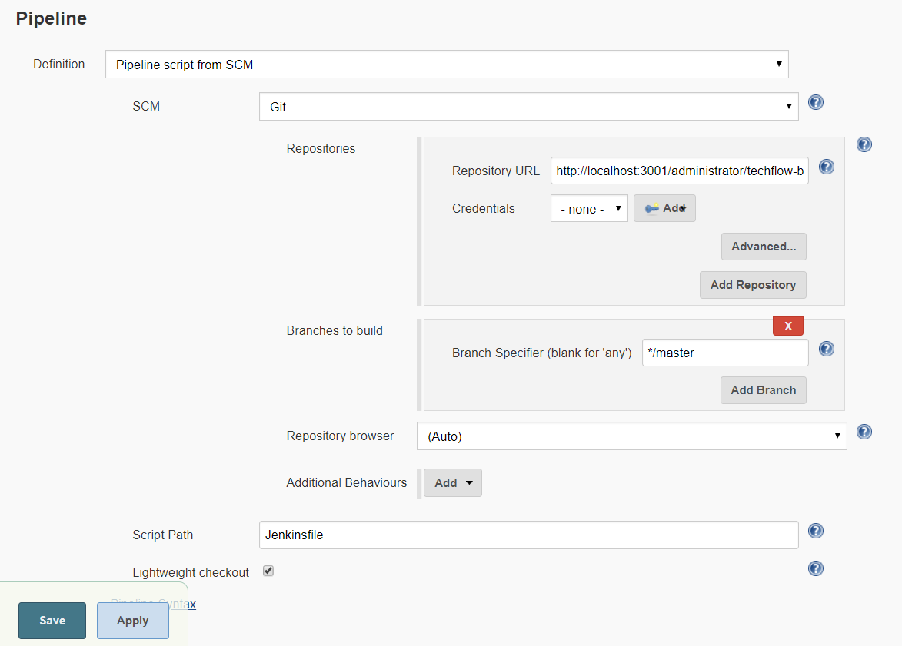

# Step By Step
Once we created the initial environment for the workshop we can continue with the step-by-step.
This it's going to be explained on the Workshop Event.

## Pre-check
Check all the resources are up and running; gitea repository on http://localhost:3000, CI tool on http://localhost:8080 and artifact repository on http://localhost:8081

## Create Jenkins Jobs
Once all the infrastructure (gitea, nexus and nexus) are up and running. We are going to continue creating the Jenkins jobs for each component, on this case one for frontend and other for the backend.

IMAGE CREATE JENKINS JOB

## Create Jenkins Pipeline
Now, we are going to create our Jenkins Pipeline as a code thought a **Jenkinsfile** [Read more about Jenkinsfiles](https://jenkins.io/doc/book/pipeline/jenkinsfile)
On this Pipeline we are going to define 4 stages:
  * Checkout the code
  * Build the project
  * Test
  * Upload artifacts (create docker images and send it to nexus)
  * Deploy

### Frontend



### Backend




## Test CI and CD pipeline

Finally we have to test the pipeline. To do that we are going to login on the virtual machine created with vagrant as follows:

```
$vagrant ssh
```

and go to the path **/vagrant/endava-techflow/app/**. This is the folder where we have our app.
We have to do small changes on the app to check if the pipeline are doing their job.

Once you have edited the files go back to Jenkins to check the pipeline runs.
